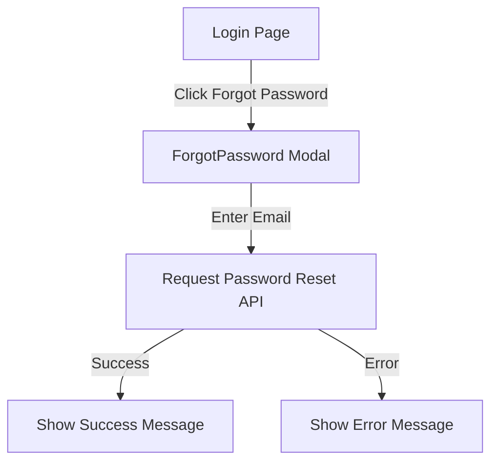
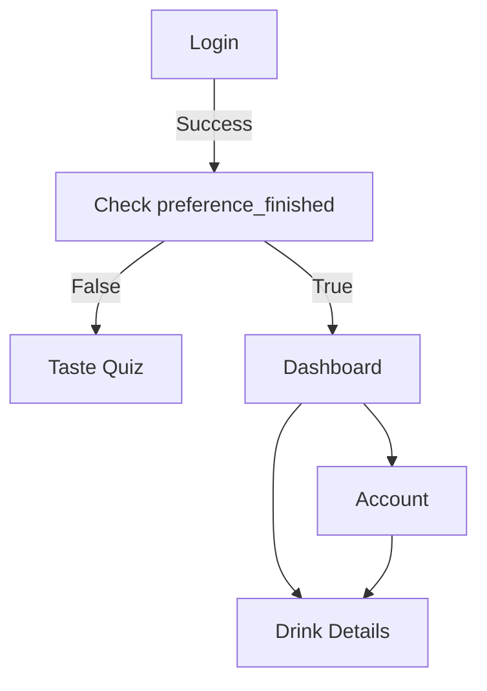
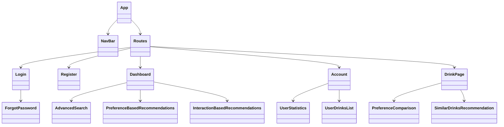

# DrinkWise Frontend Implementation Plan

## Overview
This document outlines the architectural plan for implementing the requested frontend features for DrinkWise, including component structure, API integration, and user flows.

## Current System Analysis

### Existing Components
- **Authentication**: Login, Register, AuthContext
- **Navigation**: NavBar with routing
- **Pages**: Landing, Account, DrinkPage
- **Features**: TasteQuizForm, basic search, user preferences

### Available API Endpoints

#### Authentication
- `/auth/forgot-password` - Reset user password
- `/auth/request-password-reset` - Request password reset email
- `/auth/statistics` - Get user statistics

#### Preferences
- `/preferences` - Get/Update user preferences

#### User Drinks
- `/user-drinks/favorites` - Get user's favorite drinks
- `/user-drinks/statistics` - Get user's drink interaction statistics
- `/user-drinks/{drink_id}` - Get/Update user interaction info

#### Catalog
- `/catalog/drinks` - Search and filter drinks
- `/catalog/user/similar` - Get similar drinks based on user favorites
- `/catalog/{drink_id}/similar` - Get similar drinks to a specific drink

## Implementation Plan

### 1. Forgot Password Feature

**Component**: `ForgotPassword.jsx`
**Integration**: Modal popup on Login page
**API**: `/auth/request-password-reset`, `/auth/forgot-password`



### 2. Enhanced Dashboard (Landing Page)

**Components**:
- `AdvancedSearch.jsx` - Multi-parameter search
- `PreferenceBasedRecommendations.jsx` - Drinks based on user preferences
- `InteractionBasedRecommendations.jsx` - Drinks based on user interactions

**API Integration**:
- `/catalog/drinks` with preference filters
- `/catalog/user/similar` for interaction-based recommendations

```mermaid
graph TD
    A[Dashboard] --> B[Advanced Search Bar]
    A --> C[Preference-Based Recommendations]
    A --> D[Interaction-Based Recommendations]
    
    B -->|Search with parameters| E[/catalog/drinks API]
    C -->|Get drinks matching preferences| F[/preferences + /catalog/drinks]
    D -->|Get similar to favorites| G[/catalog/user/similar]
```

### 3. Enhanced Account Page

**Components**:
- `UserStatistics.jsx` - Display user stats
- `UserDrinksList.jsx` - List of user's drinks
- `InteractedDrinksList.jsx` - List of interacted drinks

**API Integration**:
- `/auth/statistics` for user statistics
- `/user-drinks/favorites` for favorite drinks
- `/user-drinks/statistics` for interaction statistics

```mermaid
graph TD
    A[Account Page] --> B[User Profile Info]
    A --> C[User Statistics Section]
    A --> D[Favorite Drinks List]
    A --> E[Interacted Drinks List]
    
    C -->|Get stats| F[/auth/statistics API]
    D -->|Get favorites| G[/user-drinks/favorites API]
    E -->|Get interactions| H[/user-drinks/statistics API]
```

### 4. Enhanced Drink Page

**Components**:
- `PreferenceComparison.jsx` - Show how drink compares to user preferences
- `SimilarDrinksRecommendation.jsx` - Similar drink suggestions

**API Integration**:
- `/preferences` for user preferences comparison
- `/catalog/{drink_id}/similar` for similar drinks

```mermaid
graph TD
    A[Drink Page] --> B[Drink Details]
    A --> C[User Interaction Controls]
    A --> D[Preference Comparison]
    A --> E[Similar Drinks]
    
    D -->|Compare attributes| F[/preferences API]
    E -->|Get similar drinks| G[/catalog/{drink_id}/similar API]
```

### 5. Routing and Navigation Flow



## Component Architecture

### New Components to Create

1. **ForgotPassword.jsx**
   - Modal component with email input
   - Password reset form
   - API integration for password reset

2. **AdvancedSearch.jsx**
   - Multi-parameter search form
   - Category filters
   - Price tier selection
   - Sweetness/caffeine sliders
   - Search button and results

3. **PreferenceBasedRecommendations.jsx**
   - Fetch user preferences
   - Query drinks matching preferences
   - Display recommendation cards

4. **InteractionBasedRecommendations.jsx**
   - Fetch user favorites
   - Get similar drinks based on favorites
   - Display recommendation cards

5. **UserStatistics.jsx**
   - Display user activity stats
   - Show preference completion status
   - Visualize drink consumption patterns

6. **UserDrinksList.jsx**
   - List user's favorite drinks
   - Show interaction history
   - Provide navigation to drink details

7. **PreferenceComparison.jsx**
   - Compare current drink to user preferences
   - Visual indicators for attribute matching
   - Recommendation score

### Component Hierarchy



## API Integration Strategy

### Authentication Flow
1. User logs in via `/auth/login`
2. JWT token stored in AuthContext
3. Token attached to all authenticated requests

### Data Fetching Strategy
1. **Optimistic UI**: Show loading states during API calls
2. **Error Handling**: Display user-friendly error messages
3. **Caching**: Use React context for frequently accessed data
4. **Pagination**: Implement for large datasets

### API Error Handling
```javascript
try {
  const response = await axiosInstance.get('/endpoint');
  return response.data;
} catch (error) {
  if (error.response) {
    // Server responded with error status
    throw new Error(error.response.data.detail || 'Request failed');
  } else if (error.request) {
    // No response received
    throw new Error('Network error. Please try again.');
  } else {
    // Other errors
    throw new Error('An unexpected error occurred');
  }
}
```

## State Management

### Current Approach
- **AuthContext**: Manages user authentication state
- **React State**: Component-level state management
- **Local Storage**: Persists authentication tokens

### Enhanced Approach
- **Context API**: Extend for global state (preferences, favorites)
- **Custom Hooks**: For API data fetching and caching
- **Performance**: Memoize expensive computations

## User Experience Considerations

### Loading States
- Skeleton loaders for content areas
- Spinners for API calls
- Progress indicators for multi-step processes

### Error States
- Clear error messages
- Retry buttons for failed requests
- Fallback UI when data unavailable

### Accessibility
- Semantic HTML
- ARIA attributes
- Keyboard navigation
- Screen reader support

## Implementation Timeline

### Phase 1: Core Features
1. Forgot Password component
2. Enhanced Dashboard with basic recommendations
3. Updated Account page with statistics

### Phase 2: Advanced Features
1. Advanced search with multiple parameters
2. Preference comparison on drink page
3. Similar drink recommendations

### Phase 3: Polish and Testing
1. Cross-browser testing
2. Mobile responsiveness
3. Performance optimization
4. User acceptance testing

## Technical Requirements

### Dependencies
- React 18+
- React Router v6
- Axios for API calls
- Tailwind CSS for styling
- Lucide React for icons

### Development Tools
- Vite for build system
- ESLint for code quality
- Prettier for code formatting
- Jest/React Testing Library for tests

## Success Metrics

1. **Functional**: All requested features implemented
2. **Performance**: Page load times under 2 seconds
3. **Accessibility**: WCAG 2.1 AA compliance
4. **User Experience**: Intuitive navigation and clear feedback
5. **Code Quality**: Consistent style, good documentation, test coverage

## Next Steps

1. Create ForgotPassword component
2. Enhance Dashboard with recommendation sections
3. Update Account page with statistics
4. Enhance DrinkPage with comparison features
5. Implement routing for preference_finished flow
6. Comprehensive testing and documentation

This plan provides a clear roadmap for implementing all requested features while maintaining code quality and user experience standards.