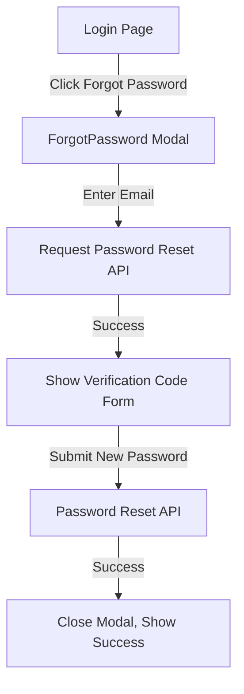
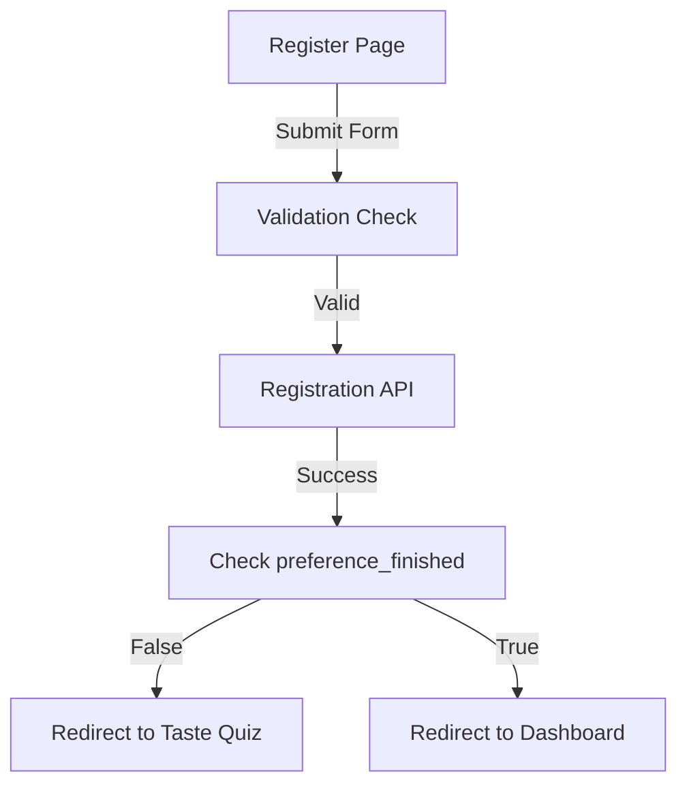
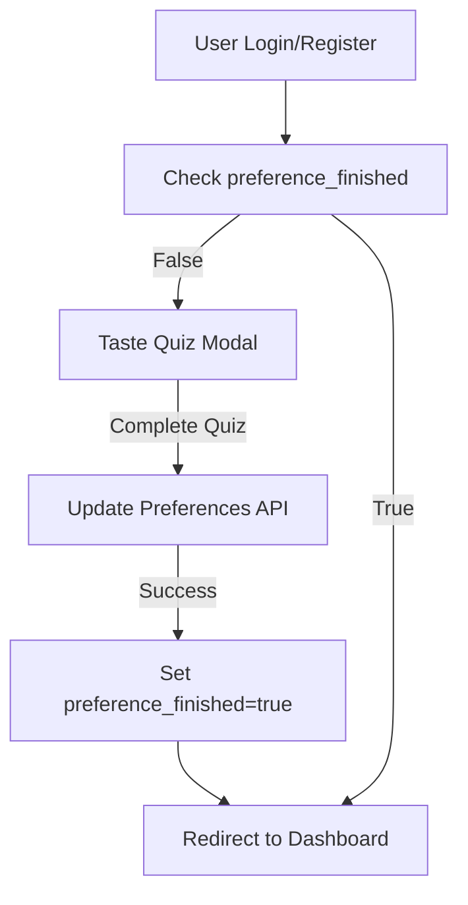
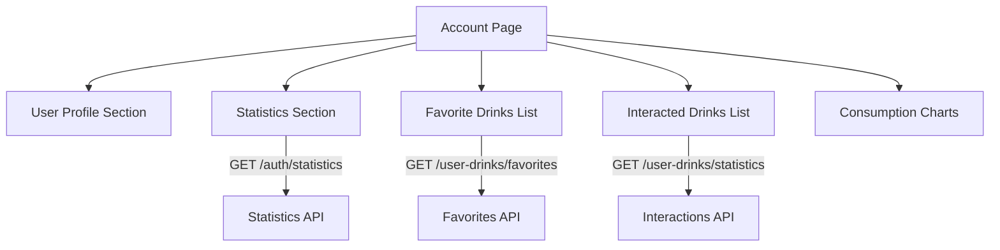
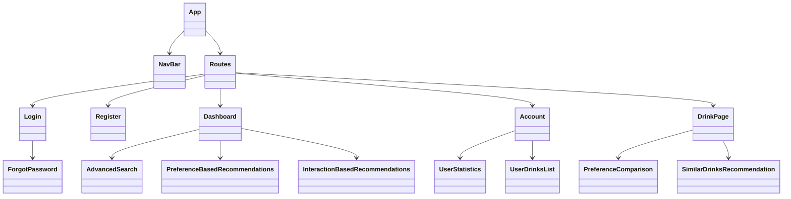

# DrinkWise Frontend Implementation Plan

## Current State Analysis

### Existing Components
- **Authentication**: Login, Register, AuthContext with JWT handling
- **Navigation**: NavBar with routing
- **Pages**: Landing (Dashboard), Account, DrinkPage
- **Features**: TasteQuizForm, basic search, user preferences
- **API Integration**: Axios helper with base URL configuration

### Gaps Identified
1. **Forgot Password**: Component exists but not integrated with Login page
2. **Registration**: Form exists but needs validation and preference_finished flow
3. **Preference Setting**: TasteQuizForm exists but needs integration with user flow
4. **Account Page**: Needs enhanced statistics and interacted drinks display
5. **Dashboard**: Needs preference-based and interaction-based recommendations
6. **Search**: Needs advanced multi-parameter search
7. **DrinkPage**: Needs preference comparison and enhanced similar drinks

## Implementation Strategy

### 1. Forgot Password Integration

**Current State**: Component exists (`ForgotPassword.jsx`) with full functionality
**Required**: Integration with Login page



### 2. Registration Form Enhancement

**Current State**: Basic registration form exists
**Required**: 
- Add validation for all fields
- Integrate with preference_finished flow
- Add date_of_birth field



### 3. Initial Preference Setting Flow

**Current State**: TasteQuizForm component exists
**Required**: 
- Integrate with user.onboarding flow
- Update user.preference_finished after completion
- Redirect based on completion status



### 4. Enhanced Account Page

**Current State**: Basic account page with profile and preferences
**Required**: 
- User statistics section
- User drinks list with pagination
- Interacted drinks list
- Visual charts for consumption patterns



### 5. Enhanced Dashboard (Landing Page)

**Current State**: Basic search functionality
**Required**: 
- Preference-based recommendations section
- Interaction-based recommendations section
- Advanced search with multiple parameters
- Category filters and price tiers

```mermaid
graph TD
    A[Dashboard] --> B[Advanced Search Section]
    A --> C[Preference-Based Recommendations]
    A --> D[Interaction-Based Recommendations]
    A --> E[Popular Drinks Section]
    
    B -->|Multi-parameter search| F[/catalog/drinks API]
    C -->|GET /preferences + /catalog/drinks| G[Preference Matching]
    D -->|GET /catalog/user/similar| H[Similar Drinks API]
```

### 6. Enhanced Drink Page

**Current State**: Basic drink details and simple recommendations
**Required**: 
- Preference comparison visualization
- Enhanced similar drinks with similarity scores
- Detailed attribute comparison
- User interaction history

```mermaid
graph TD
    A[Drink Page] --> B[Drink Details Section]
    A --> C[User Interaction Controls]
    A --> D[Preference Comparison]
    A --> E[Similar Drinks Recommendations]
    A --> F[Attribute Analysis]
    
    D -->|GET /preferences| G[User Preferences]
    E -->|GET /catalog/{id}/similar| H[Similar Drinks API]
```

## Component Architecture

### New Components to Create

1. **AdvancedSearch.jsx**
   - Multi-parameter search form
   - Category dropdown
   - Price tier selection
   - Sweetness/caffeine sliders
   - Allergen filters

2. **PreferenceBasedRecommendations.jsx**
   - Fetch user preferences
   - Query drinks matching preferences
   - Display recommendation cards with match scores

3. **InteractionBasedRecommendations.jsx**
   - Fetch user favorites
   - Get similar drinks based on favorites
   - Display with similarity explanations

4. **UserStatistics.jsx**
   - Display consumption statistics
   - Show preference completion
   - Visualize drink patterns

5. **UserDrinksList.jsx**
   - List favorite drinks
   - Show interaction history
   - Pagination support

6. **PreferenceComparison.jsx**
   - Compare drink to user preferences
   - Visual indicators for matching
   - Recommendation score calculation

### Component Hierarchy



## API Integration Plan

### Authentication Flow
1. User logs in via `/auth/login`
2. JWT token stored in AuthContext
3. Token attached to all authenticated requests
4. Check `user.preference_finished` on login

### Data Fetching Strategy
1. **Optimistic UI**: Show loading states during API calls
2. **Error Handling**: Display user-friendly error messages
3. **Caching**: Use React context for frequently accessed data
4. **Pagination**: Implement for large datasets

### API Endpoints to Implement

| Feature | Endpoint | Method | Auth Required |
|---------|----------|--------|---------------|
| Forgot Password Request | `/auth/request-password-reset` | POST | No |
| Password Reset | `/auth/forgot-password` | POST | No |
| User Statistics | `/auth/statistics` | GET | Yes |
| User Preferences | `/preferences` | GET/PUT | Yes |
| User Favorites | `/user-drinks/favorites` | GET | Yes |
| User Interactions | `/user-drinks/statistics` | GET | Yes |
| Similar Drinks (User) | `/catalog/user/similar` | GET | Yes |
| Similar Drinks (Drink) | `/catalog/{id}/similar` | GET | No |
| Advanced Search | `/catalog/drinks` | GET | No |

## Implementation Timeline

### Phase 1: Core Features (Days 1-3)
1. **Day 1**: Forgot Password integration
   - Integrate ForgotPassword modal with Login page
   - Test password reset flow
   
2. **Day 2**: Registration and Preference Flow
   - Enhance registration form with validation
   - Implement preference_finished routing
   - Create Taste Quiz modal for new users
   
3. **Day 3**: Account Page Enhancement
   - Add user statistics section
   - Implement user drinks list
   - Add interacted drinks display

### Phase 2: Dashboard Features (Days 4-5)
4. **Day 4**: Advanced Search Implementation
   - Create AdvancedSearch component
   - Implement multi-parameter filtering
   - Add category and price filters
   
5. **Day 5**: Recommendation Systems
   - Implement PreferenceBasedRecommendations
   - Create InteractionBasedRecommendations
   - Integrate with Dashboard

### Phase 3: Drink Page & Final Touches (Days 6-7)
6. **Day 6**: Enhanced Drink Page
   - Add PreferenceComparison component
   - Enhance similar drinks display
   - Add attribute analysis
   
7. **Day 7**: Testing and Optimization
   - Cross-browser testing
   - Mobile responsiveness
   - Performance optimization
   - Code quality review

## Technical Requirements

### Dependencies
- React 18+
- React Router v6
- Axios for API calls
- Tailwind CSS for styling
- Chart.js for statistics visualization

### Development Tools
- Vite for build system
- ESLint for code quality
- Prettier for code formatting
- Jest/React Testing Library for tests

## Success Metrics

1. **Functional**: All requested features implemented
2. **Performance**: Page load times under 2 seconds
3. **Accessibility**: WCAG 2.1 AA compliance
4. **User Experience**: Intuitive navigation and clear feedback
5. **Code Quality**: Consistent style, good documentation, test coverage

## Risk Assessment

### Potential Risks
1. **API Compatibility**: Backend endpoints may not match documentation
2. **Authentication Issues**: JWT token handling complexity
3. **Performance**: Large datasets may cause slow rendering
4. **Browser Compatibility**: CSS/JS features may not work everywhere

### Mitigation Strategies
1. **API Testing**: Test all endpoints before implementation
2. **Error Handling**: Robust error handling for API calls
3. **Pagination**: Implement pagination for all lists
4. **Feature Detection**: Use progressive enhancement

## Next Steps

1. **Immediate**: Integrate ForgotPassword with Login page
2. **Priority**: Implement preference_finished routing
3. **Critical**: Enhance Account page with statistics
4. **Important**: Create advanced search functionality
5. **Final**: Test all features comprehensively

This plan provides a clear roadmap for implementing all requested features while maintaining code quality and user experience standards.